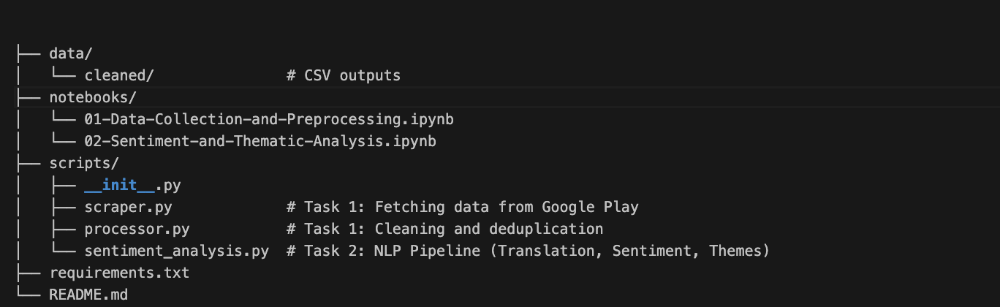

📱 Google Play Store Review Analytics

10 Academy: Artificial Intelligence Mastery - Week 2 Challenge
Uncovering actionable insights from Ethiopian banking app reviews through Data Engineering and NLP.

📖 Project Overview

This project is a modular data pipeline designed to scrape, clean, and analyze user reviews from the Google Play Store for major Ethiopian banking applications (CBE, Bank of Abyssinia, Dashen Bank). It quantifies user sentiment and identifies recurring themes to uncover satisfaction drivers and pain points.

The Core Goal:
To transform raw, unstructured user feedback into structured actionable data (Sentiment Scores & Thematic Categories) for product improvement.

🚀 Key Features

Data Collection: Automated scraping using google-play-scraper.

Preprocessing Engine: Deduplication, date normalization, and handling of missing values.

Multilingual Support: Automatic language detection and translation (Amharic → English) using deep-translator.

Sentiment Analysis: Polarity scoring using VADER (Valence Aware Dictionary and sEntiment Reasoner).

Thematic Analysis: Hybrid approach using TF-IDF for keyword discovery and Regex-based pattern matching for theme assignment.

Modular Architecture: Clean, reusable Python scripts located in scripts/.

📂 Repository Structure

 
<em>Fig 1: Project Directory Structure</em>

🛠 Installation & Setup

Follow these steps to set up a reproducible environment.

1. Clone the Repository
code
Bash
download
content_copy
expand_less
git clone https://github.com/zemicahel/kaim-week2.git
cd kaim-week2
2. Virtual Environment

It is best practice to run this project in a virtual environment.

code
Bash
download
content_copy
expand_less
python -m venv venv
# Windows
venv\Scripts\activate
# Linux/macOS
source venv/bin/activate
3. Install Dependencies
code
Bash
download
content_copy
expand_less
pip install pandas numpy google-play-scraper vaderSentiment langdetect deep-translator scikit-learn
📊 Workflow & Methodology

The project is executed in two distinct phases, mirroring the modular scripts in the scripts/ directory.

Phase 1: Data Collection & Preprocessing

Objective: Ingest raw reviews and prepare a clean dataset.
Tools: google-play-scraper, pandas.

Scraping (scraper.py): Fetches 450+ reviews per bank (CBE, BoA, Dashen).

Processing (processor.py):

Renames columns for consistency.

Removes duplicates based on review_text and bank.

Standardizes dates to YYYY-MM-DD.

Usage:

code
Python
download
content_copy
expand_less
from scripts.scraper import fetch_reviews
from scripts.processor import process_and_save

# Fetch and Clean
df = fetch_reviews(['com.combanketh.mobilebanking'], count_per_app=450)
process_and_save(df, output_file='../data/cleaned/bank_reviews_cleaned.csv')
Phase 2: Sentiment & Thematic Analysis

Objective: Convert text into numerical sentiment data and categorical themes.
Tools: VADER, TF-IDF, Regex.

Translation: Detects language; translates Amharic/Unknown to English.

Sentiment Scoring:

Positive: Compound score 
≥
≥
 0.05

Negative: Compound score 
≤
≤
 -0.05

Neutral: Score between -0.05 and 0.05

Thematic Categorization:

Discovery: Uses TF-IDF to find top keywords per bank.

Tagging: Maps reviews to themes: Access Issues, Transaction Performance, UI/UX, Customer Support, Features.

Usage:

code
Python
download
content_copy
expand_less
from scripts.sentiment_analysis import run_pipeline

# Run the full NLP pipeline
run_pipeline(
    input_path="../data/cleaned/bank_reviews_cleaned.csv",
    output_path="../data/cleaned/task2_reviews_analyzed.csv",
    summary_path="../data/cleaned/task2_sentiment_summary.csv"
)
📉 Outputs & Results

The pipeline generates the following data assets in the data/cleaned/ folder:

File Name	Description
bank_reviews_cleaned.csv	Raw cleaned data from Task 1 (Scraping).
task2_reviews_analyzed.csv	Final dataset including sentiment_score, sentiment_label, and identified_themes.
task2_sentiment_summary.csv	Aggregated view showing average sentiment per Bank and Star Rating.
🔮 Future Work

Transformer Models: Upgrade from VADER to distilbert-base-uncased-finetuned-sst-2-english for higher accuracy.

Topic Modeling: Implement LDA (Latent Dirichlet Allocation) for unsupervised topic discovery.

Dashboarding: Build a Streamlit app to visualize the sentiment trends over time.

🤝 Contributing

Contributions are welcome! Please follow the standard Git workflow:

Fork the Project

Create your Feature Branch (git checkout -b feature/AmazingFeature)

Commit your Changes (git commit -m 'Add some AmazingFeature')

Push to the Branch (git push origin feature/AmazingFeature)

Open a Pull Request

📜 License

Distributed under the MIT License. See LICENSE for more information.

📞 Contact

Zemicahel

